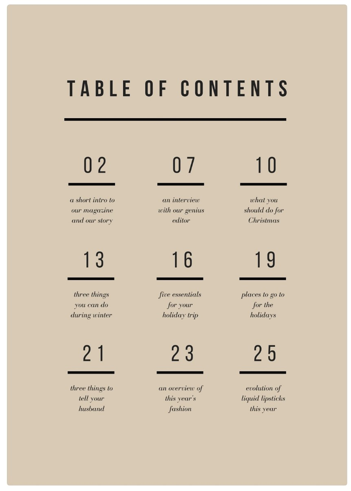
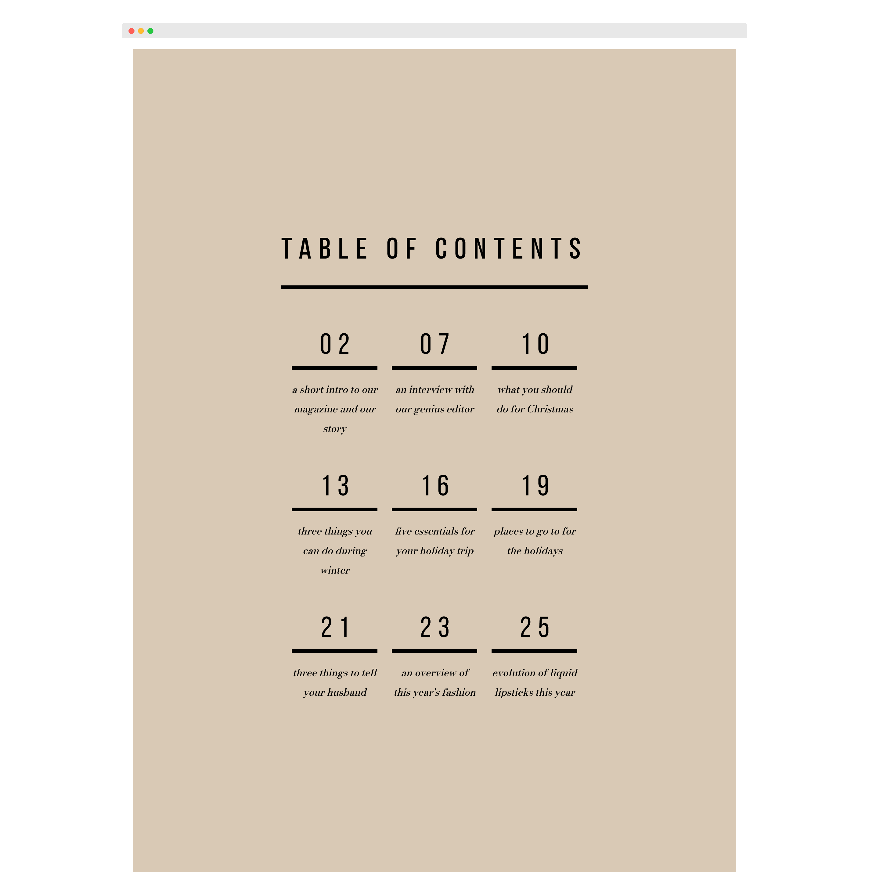

# Canva Table of Contents Template Clone by Corvida Raven

> A clone of the following Canva template:

## Preview Shots

<figure>

<figcaption>Canva Template </figcaption>
</figure>

<figure>
<figcaption>My Clone</figcaption>
</figure>

- [My Clone](https://shegeeks.github.io/Practice/clones/table-of-contents/)
- [Canva Template](https://www.canva.com/templates/EADaoAIJ6yU-beige-and-black-minimal-general-table-of-contents/)

## Process

While searching for Canva templates for something entirely different, I ran across this beautifully minimal table of contents. This is my attempt at recreating it, which was easy to achieve using CSS Grid for the entire layout.

Since Canva lets you customize fonts, i could quickly identify what this template used. While both were available via Google Fonts, Bebas Neue font applied to the page numbers required a lighter weight than Google Fonts supports. This led to using a self-hosted TFF with the supported weight and Google Fonts for the paragraph font only.

All in all, I recreated this template in under 30 mins with CSS Grid.

### Tech Stacks

- Semantic HTML5
- CSS3
- CSS Grid
- Flexbox
- Mobile-ready

### Useful Resources

- [Relationship of grid layout to other layout methods](https://developer.mozilla.org/en-US/docs/Web/CSS/CSS_Grid_Layout/Relationship_of_Grid_Layout)
- [How To Set Weights And Styles With The @font-face Declaration](https://www.smashingmagazine.com/2013/02/setting-weights-and-styles-at-font-face-declaration/)
- Headings Font: [Bebas Neue](https://www.fontfabric.com/fonts/bebas-neue/)
- Paragraphs Font: [Bodoni Moda](https://fonts.google.com/specimen/Bodoni+Moda)

## Contact

- Portfolio: [Link](https://corvida.netlify.app/)
- Twitter: [@Corvida](https://www.twitter.com/corvida)

---

  
