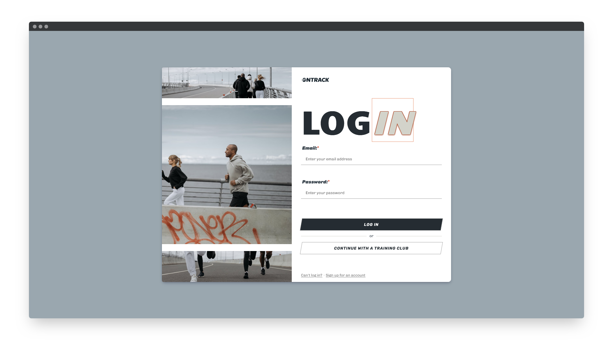

# Login Screen v2

_Challenge provided by iCodeThis.com_

[Live Demo](https://shegeeks.github.io/Practice/ict-login-screen/)

## Process

  
 <i>Provided design from iCodeThis</i>

iCodeThis provided an easy and popular split-screen design. I submitted v1 for this challenge and was pretty happy with what I was able to build in 48 hours including the form validation. I went for a more minimal look with the buttons, while still incorporating all the components of the original design.

_v1_

For v2, I put my own spin on this popular layout pattern by dividing the image side of the screen into three sections. Each section holds a different image in line with the theme of fitness. Though the design provided by iCodeThis lacks a logo, most login screens have one. So I created one a fake brand, OnTrack, and made a quick and simple logo featuring their name and a victory flag.

I also switched up the color scheme for a more modern and cleaner look. I think its a major improvement over the original design. [See for yourself here](https://shegeeks.github.io/Practice/ict-login-screen/).
