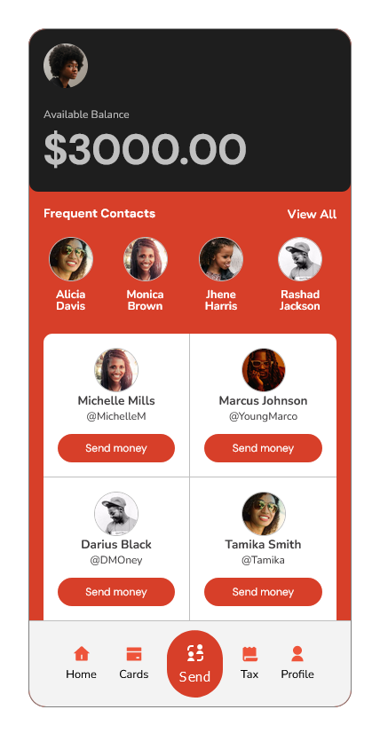
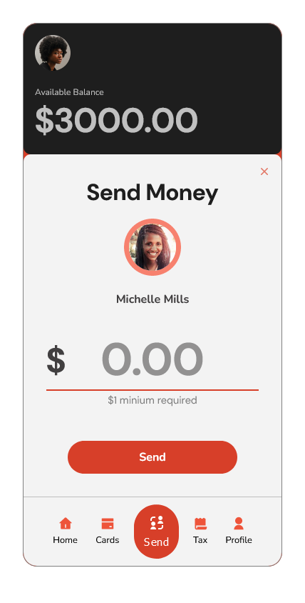
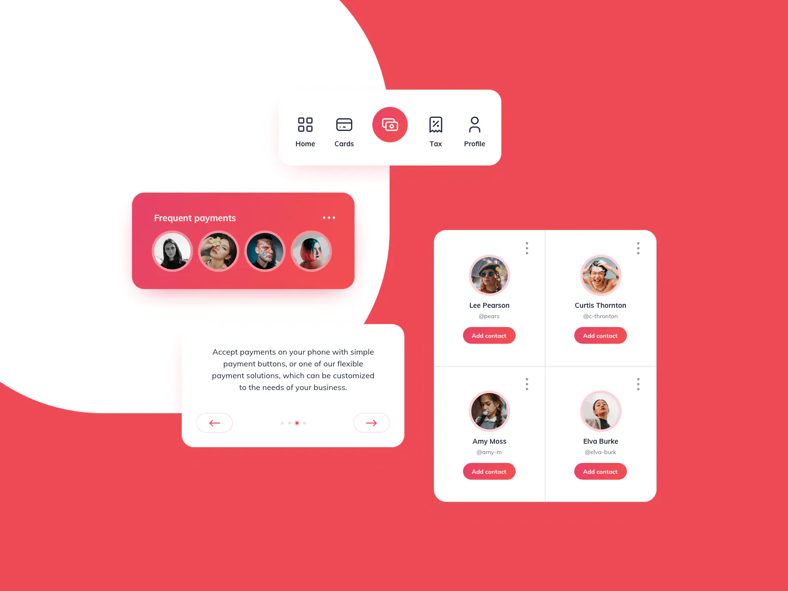

# Payment App

_Challenge provided by iCodeThis.com_

  
  

[Live Demo](https://shegeeks.github.io/Practice/ict-payment-app/)
| _View on mobile for best results_

## Process

This was a mad dash project to finish within 48 hours. There was much more functionality I wanted to implement, and might do at a later time, but I'm pleased with this "rapid prototype" of a payment app using the provided components from the original design.

  
 <i>Provided design from iCodeThis</i>

iCodeThis provided a great starting point, but the first thing I knew I wanted to add was a balance component. How can you send any money if you don't know how much you have to send? I also wasn't the biggest fan of the given design, which felt too bubbly for a payments app. I went with a more minimal, clean while still retaining the a young vibrant feel witht he loud orange red color.

Though it's not shown in the original design, I added the ability to send money to any of the contacts shown. [Give it a try here.](https://shegeeks.github.io/Practice/ict-payment-app/).
